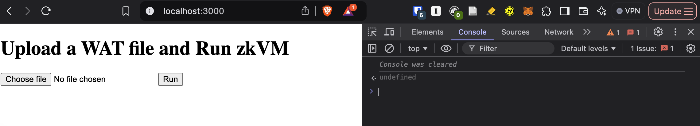

## Prerequisites

- Install node.js and npm
- Install rust
- Install wasm-pack
```
cargo install wasm-pack
```

## Build rust code

```
RUSTFLAGS="-C target-feature=+simd128" wasm-pack build --target no-modules --release --out-dir www/pkg
```

## Run the web app

```
cd www
```

```
npm install
```

```
npx serve
```

Open the browser and navigate to `http://localhost:3000`.

## Prove and verify a Fibonacci sequence



Select file `fib.wat` and click run.

Open console and check the output.
